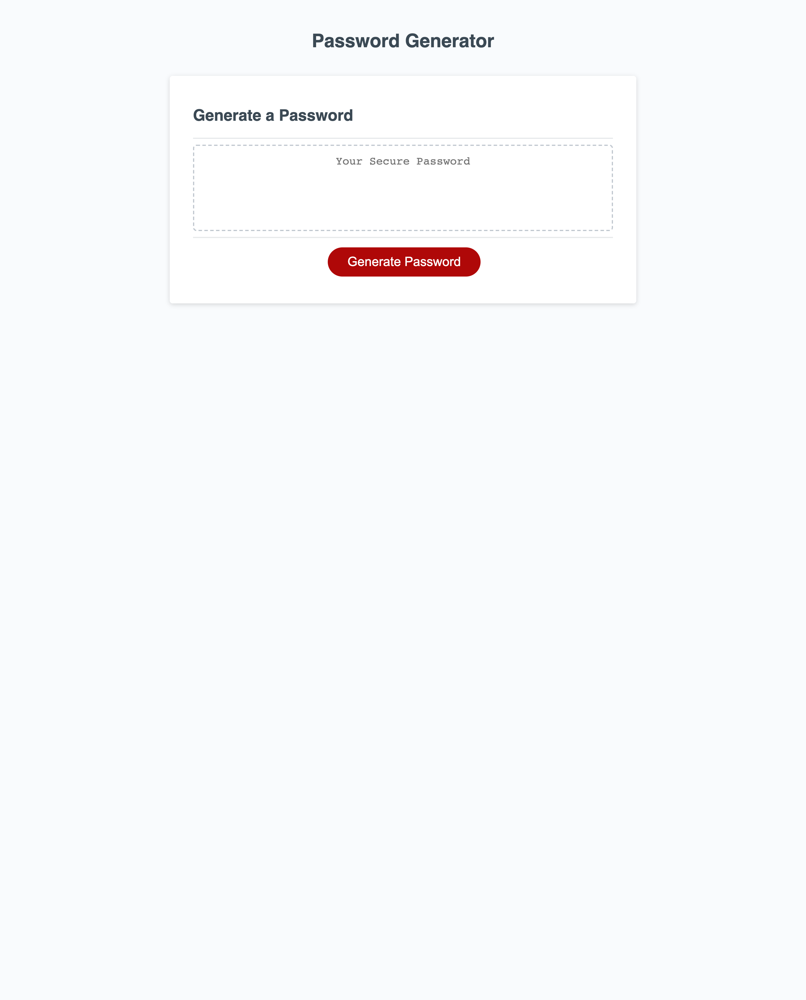

# Random Password Generator

## Description

Allows you to select the character types you would like to be in the passcode, allows you to decide how long the password is going to be, and will randomly generate a password based off of the users input.

## Table of contents

- Where to find
- Credit
- License
- Screenshot

## Where to find

Link: https://connor812.github.io/Random-Password-Generator/

## Credit

I would love to give out some credit to the University of Toronto for supplying some starting code to work off of. As well as Taddeo, a fellow classmate that helped with the debugging of this code.

## License

GNU GENERAL PUBLIC LICENSE
Version 3, 29 June 2007

## Screenshot

